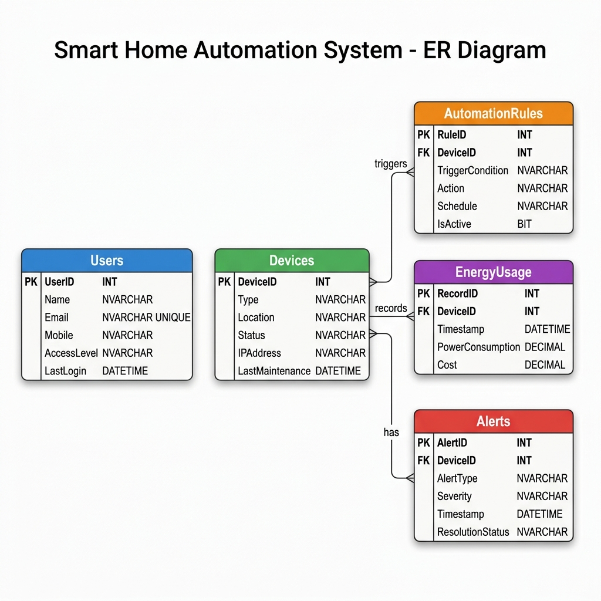
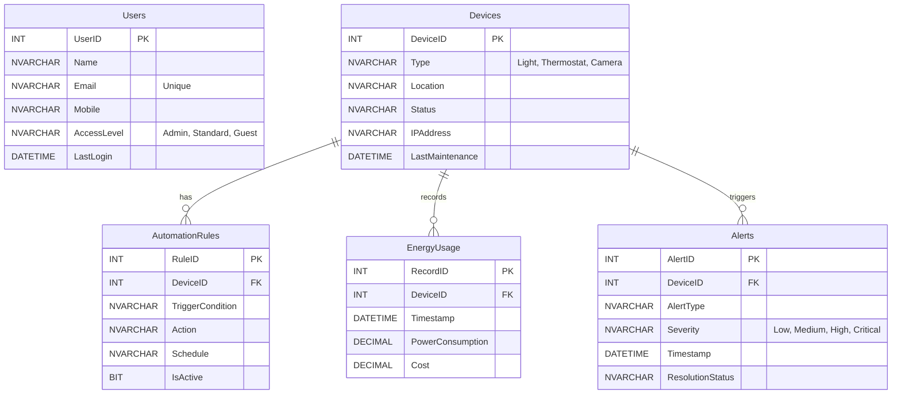

# Smart Home Automation System - Database Documentation

## 1. Entity-Relationship (ER) Diagram



### Mermaid Representation


## 2. Database Schema Details

### Tables and Keys
- **`Users`**: Stores user profiles.
  - Primary Key: `UserID`
  - Unique Constraint: `Email`
  - Check Constraints: `AccessLevel` must be 'Admin', 'Standard', or 'Guest'.
- **`Devices`**: Central inventory of all IoT smart home devices.
  - Primary Key: `DeviceID`
  - Check Constraints: `Type` must be 'Light', 'Thermostat', or 'Camera'.
- **`AutomationRules`**: Defines automatic actions executed under specific conditions.
  - Primary Key: `RuleID`
  - Foreign Key: `DeviceID` references `Devices(DeviceID)`.
- **`EnergyUsage`**: Logs power consumption instances and costs per device.
  - Primary Key: `RecordID`
  - Foreign Key: `DeviceID` references `Devices(DeviceID)`.
- **`Alerts`**: System notifications or issues requiring attention.
  - Primary Key: `AlertID`
  - Foreign Key: `DeviceID` references `Devices(DeviceID)`.
  - Check Constraints: `Severity` must be 'Low', 'Medium', 'High', or 'Critical'.

### Essential Stored Procedures
1. `usp_AddUser`: Registers a new user with proper data types and parameters.
2. `sp_RegisterDevice`: Inserts a new device into the system and sets its default status to 'Online'.
3. `sp_LogEnergyUsage`: Calculates cost dynamically based on power consumption and inserts the record.
4. `sp_TriggerAlert`: Easily generates an alert tied to a specific device.
5. `sp_ResolveAlert`: Updates the resolution status of an alert to 'Resolved'.

### Critical Reporting Views
1. `vw_ActiveAlerts`: Joins `Alerts` and `Devices` to show active/pending issues needing attention.
2. `vw_MonthlyEnergySummary`: Aggregates energy consumption and calculates total cost grouped by month, year, and device.
3. `vw_ActiveAutomationRules`: Shows all currently active rules linked to their specific devices.
4. `vw_DeviceStatusReport`: Provides an overview of all devices, including calculated days since their last maintenance.

## 3. Backup and Recovery Strategy

A robust database system for Smart Home IoT needs high availability, as devices are sending telemetry constantly. 

### Recommended Strategy: Full Recovery Model
Since energy logging and active alerts occur continually, the database should be set to the **Full Recovery Model** to prevent data loss.

### 1. Full Database Backup
- **Frequency**: Daily (e.g., during off-peak hours like 2:00 AM)
- **Purpose**: Captures the entire database structure, configuration, and data at that point in time. Provides the baseline for recovery.

```sql
BACKUP DATABASE SmartHomeDB 
TO DISK = 'D:\Backups\SmartHomeDB_Full.bak' 
WITH FORMAT, INIT, NAME = 'Full Backup of SmartHomeDB';
```

### 2. Differential Backup
- **Frequency**: Every 4 to 6 hours
- **Purpose**: Captures only the data that has changed since the last Full Backup. This dramatically reduces the restore time if a failure occurs later in the day.

```sql
BACKUP DATABASE SmartHomeDB 
TO DISK = 'D:\Backups\SmartHomeDB_Diff.bak' 
WITH DIFFERENTIAL, NAME = 'Differential Backup of SmartHomeDB';
```

### 3. Transaction Log Backup
- **Frequency**: Every 15 to 30 minutes
- **Purpose**: Protects against data loss for the frequent inserts in the `EnergyUsage` and `Alerts` tables. This enables Point-in-Time recovery up to the minute before a failure occurs.

```sql
BACKUP LOG SmartHomeDB 
TO DISK = 'D:\Backups\SmartHomeDB_Log.trn' 
WITH NAME = 'Transaction Log Backup of SmartHomeDB';
```

### Disaster Recovery Plan
If a server failure happens at 4:20 PM:
1. Restore the last **Full Backup** (from 2:00 AM) with `NORECOVERY`.
2. Restore the latest **Differential Backup** (from 2:00 PM) with `NORECOVERY`.
3. Restore all subsequent **Transaction Log Backups** (from 2:15 PM, 2:30 PM, ..., 4:15 PM) with `RECOVERY` to bring the database online exactly as it was.
